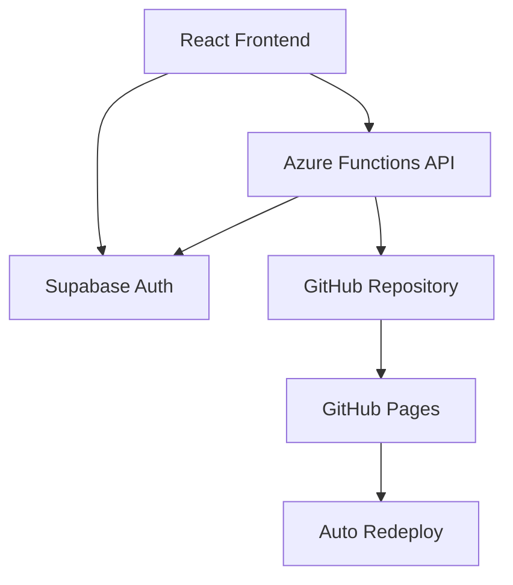

# EduPress 🎓

A modern MVP platform where university students can publish and share academic articles. Built with React, TypeScript, Azure Functions, and powered by Supabase authentication.


## ✨ Features

- 🔐 **Secure Authentication** - Supabase-powered email/password login
- 📝 **Rich Article Publishing** - Simple, intuitive publishing interface
- 📚 **Article Discovery** - Browse articles sorted by newest first
- 🚀 **Auto-Deployment** - Articles automatically trigger site redeployment
- 🔒 **JWT Security** - Server-side token validation
- 📱 **Responsive Design** - Works on desktop, tablet, and mobile
- ⚡ **Fast & Free** - Built on free-tier services
- 🎯 **Student-Focused** - Designed specifically for academic publishing

## 🏗️ Architecture



- **Frontend**: React 18 + TypeScript deployed on GitHub Pages
- **Backend**: Azure Functions with .NET 8 isolated worker model
- **Authentication**: Supabase with JWT token validation
- **Storage**: Articles stored as JSON files in GitHub repository
- **CI/CD**: GitHub Actions for automatic deployment

## 🚀 Quick Start

### Prerequisites

- [Node.js 18+](https://nodejs.org/)
- [.NET 8 SDK](https://dotnet.microsoft.com/download)
- [Azure Functions Core Tools v4](https://docs.microsoft.com/azure/azure-functions/functions-run-local)
- [Supabase Account](https://supabase.com)
- [Azure Account](https://azure.microsoft.com) (free tier works)
- [GitHub Account](https://github.com)

### Local Development

1. **Clone the repository:**
   ```bash
   git clone https://github.com/yourusername/edupress.git
   cd edupress
   ```

2. **Frontend Setup:**
   ```bash
   cd frontend
   npm install
   ```
   
   Create `frontend/.env`:
   ```env
   REACT_APP_SUPABASE_URL=https://your-project.supabase.co
   REACT_APP_SUPABASE_ANON_KEY=your_supabase_anon_key
   REACT_APP_API_BASE_URL=http://localhost:7071/api
   ```

3. **Backend Setup:**
   ```bash
   cd backend
   dotnet restore
   ```
   
   Update `backend/local.settings.json`:
   ```json
   {
     "IsEncrypted": false,
     "Values": {
       "AzureWebJobsStorage": "UseDevelopmentStorage=true",
       "FUNCTIONS_WORKER_RUNTIME": "dotnet-isolated",
       "SUPABASE_JWT_SECRET": "your_supabase_jwt_secret",
       "GITHUB_TOKEN": "your_github_personal_access_token",
       "GITHUB_REPO": "yourusername/your-repo-name",
       "GITHUB_BRANCH": "main"
     }
   }
   ```

4. **Start development servers:**
   ```bash
   # Terminal 1 - Backend
   cd backend && func start
   
   # Terminal 2 - Frontend
   cd frontend && npm start
   ```

5. **Visit http://localhost:3000** and start publishing! 🎉

## 📚 Documentation

- **[Development Guide](DEVELOPMENT.md)** - Detailed development setup
- **[Deployment Guide](DEPLOYMENT.md)** - Production deployment instructions
- **[API Documentation](#api-endpoints)** - Backend API reference

## 🛠️ Tech Stack

### Frontend
- **React 18** - Modern React with hooks
- **TypeScript** - Type-safe JavaScript
- **React Router** - Client-side routing
- **Axios** - HTTP client
- **CSS3** - Modern styling with CSS Grid/Flexbox

### Backend
- **.NET 8** - Latest .NET with isolated worker model
- **Azure Functions** - Serverless compute
- **Octokit** - GitHub API integration
- **JWT Validation** - Secure token verification
- **Newtonsoft.Json** - JSON serialization

### Services
- **Supabase** - Authentication and user management
- **GitHub** - Article storage and deployment trigger
- **GitHub Pages** - Static site hosting
- **Azure Functions** - API hosting

## 📡 API Endpoints

| Method | Endpoint | Description | Auth Required |
|--------|----------|-------------|---------------|
| `GET` | `/api/get-articles` | Get all articles metadata | ❌ |
| `GET` | `/api/get-article/{slug}` | Get article by slug | ❌ |
| `POST` | `/api/publish-article` | Publish new article | ✅ |
| `OPTIONS` | `/api/*` | CORS preflight | ❌ |

### Example: Publishing an Article

```typescript
const article = {
  title: "My Research Paper",
  author: "Jane Doe",
  content: "# Introduction\n\nThis is my research..."
};

const response = await fetch('/api/publish-article', {
  method: 'POST',
  headers: {
    'Content-Type': 'application/json',
    'Authorization': `Bearer ${supabaseToken}`
  },
  body: JSON.stringify(article)
});
```

## 🏗️ Project Structure

```
edupress/
├── 📁 frontend/                    # React TypeScript app
│   ├── 📁 src/
│   │   ├── 📁 components/         # Reusable React components
│   │   ├── 📁 pages/             # Page components
│   │   ├── 📁 services/          # API services
│   │   ├── 📁 types/             # TypeScript definitions
│   │   └── 📁 utils/             # Utility functions
│   ├── 📁 public/                # Static assets
│   └── 📄 package.json
├── 📁 backend/                     # Azure Functions (.NET 8)
│   ├── 📁 Functions/             # HTTP trigger functions
│   ├── 📁 Models/                # Data models
│   ├── 📁 Services/              # Business logic services
│   ├── 📄 Program.cs             # App configuration
│   └── 📄 EduPressApi.csproj
├── 📁 articles/                    # Article JSON storage
├── 📁 .github/workflows/          # GitHub Actions CI/CD
├── 📄 DEVELOPMENT.md              # Development guide
├── 📄 DEPLOYMENT.md               # Deployment guide
└── 📄 README.md                   # This file
```

## 💰 Cost Breakdown

| Service | Free Tier | Estimated Monthly Cost |
|---------|-----------|------------------------|
| **Supabase** | 50MB DB, 500MB storage | $0 |
| **GitHub** | Unlimited public repos | $0 |
| **GitHub Pages** | 1GB storage | $0 |
| **Azure Functions** | 1M requests, 400GB-s | $0 |
| **Total** | | **$0/month** 🎉 |

*Perfect for MVP and small-scale deployments!*

## 🔒 Security Features

- ✅ JWT token validation on all protected endpoints
- ✅ Supabase authentication with email verification
- ✅ CORS configuration for secure cross-origin requests
- ✅ Input validation and sanitization
- ✅ Environment variable protection for secrets
- ✅ GitHub token with minimal required permissions

## 🤝 Contributing

We welcome contributions! Please see our [contributing guidelines](CONTRIBUTING.md).

1. Fork the repository
2. Create a feature branch: `git checkout -b feature/amazing-feature`
3. Commit your changes: `git commit -m 'Add amazing feature'`
4. Push to the branch: `git push origin feature/amazing-feature`
5. Open a Pull Request

## 🐛 Issues & Support

- **Bug Reports**: [GitHub Issues](https://github.com/yourusername/edupress/issues)
- **Feature Requests**: [GitHub Discussions](https://github.com/yourusername/edupress/discussions)
- **Documentation**: Check our [docs folder](./docs/)

## 📈 Roadmap

- [ ] **Article Search** - Full-text search capabilities
- [ ] **User Profiles** - Author profile pages
- [ ] **Article Categories** - Organize by subject/department  
- [ ] **Commenting System** - Peer review and discussion
- [ ] **Email Notifications** - New article alerts
- [ ] **Rich Text Editor** - WYSIWYG editing experience
- [ ] **Article Analytics** - View counts and engagement metrics
- [ ] **PDF Export** - Download articles as PDFs
- [ ] **Social Sharing** - Share articles on social media
- [ ] **Admin Dashboard** - Content moderation tools

## 📄 License

This project is licensed under the MIT License - see the [LICENSE](LICENSE) file for details.

## 🌟 Acknowledgments

- **Supabase** for excellent authentication service
- **Azure** for reliable serverless hosting
- **GitHub** for free hosting and CI/CD
- **React Team** for the amazing framework
- **Microsoft** for .NET and TypeScript

## 📞 Contact

Created by **[Your Name]** - [@yourhandle](https://twitter.com/yourhandle)

Project Link: [https://github.com/yourusername/academix](https://github.com/yourusername/academix)

---

<div align="center">

**Built with ❤️ for the academic community**

[⬆ Back to top](#academix-)

</div>
